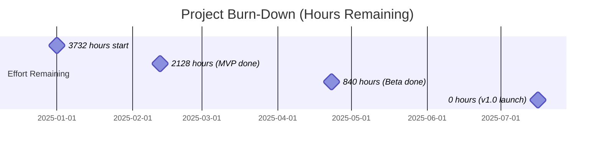

# LLM-Latency-Lens Project Estimates

## Effort Breakdown by Phase

### MVP Phase (Weeks 1-6)

| Task ID | Task Name | Complexity | Effort (Hours) | Dependencies | Risk Level |
|---------|-----------|------------|---------------|--------------|------------|
| MVP-1.1 | Project Setup & Architecture Design | Medium | 40 | None | Low |
| MVP-1.2 | Core Type Definitions & Interfaces | Low | 16 | MVP-1.1 | Low |
| MVP-1.3 | OpenAI Provider Implementation | Medium | 48 | MVP-1.2 | Medium |
| MVP-1.4 | Authentication & API Key Management | Low | 16 | MVP-1.3 | Low |
| MVP-1.5 | Request/Response Handling | Medium | 32 | MVP-1.3 | Medium |
| MVP-1.6 | Error Handling & Retry Logic | Medium | 24 | MVP-1.5 | Medium |
| MVP-2.1 | High-Resolution Timing System | Medium | 24 | MVP-1.2 | Medium |
| MVP-2.2 | Basic Metrics Collection | Medium | 32 | MVP-2.1 | Medium |
| MVP-2.3 | Statistical Calculations | Medium | 24 | MVP-2.2 | Low |
| MVP-2.4 | Metric Aggregation Engine | Medium | 32 | MVP-2.3 | Medium |
| MVP-3.1 | CLI Framework Setup | Low | 16 | MVP-1.1 | Low |
| MVP-3.2 | Command Parsing & Validation | Medium | 24 | MVP-3.1 | Low |
| MVP-3.3 | Interactive Prompts | Low | 16 | MVP-3.2 | Low |
| MVP-3.4 | Progress Indicators | Low | 16 | MVP-3.1 | Low |
| MVP-3.5 | Output Formatting & Display | Medium | 24 | MVP-3.1 | Low |
| MVP-4.1 | JSON Schema Design | Low | 8 | MVP-2.4 | Low |
| MVP-4.2 | JSON Serialization | Low | 16 | MVP-4.1 | Low |
| MVP-4.3 | Schema Validation | Low | 16 | MVP-4.2 | Low |
| MVP-5.1 | Unit Testing Setup | Low | 16 | MVP-1.1 | Low |
| MVP-5.2 | Unit Tests (Core Logic) | Medium | 48 | All MVP | Medium |
| MVP-5.3 | Integration Tests | Medium | 40 | All MVP | Medium |
| MVP-5.4 | E2E Tests | Medium | 32 | All MVP | Medium |
| MVP-6.1 | Documentation (README, Usage) | Low | 24 | All MVP | Low |
| MVP-6.2 | Docker Setup | Low | 16 | MVP-1.1 | Low |
| MVP-6.3 | CI/CD Pipeline | Medium | 24 | MVP-5.1 | Low |

**MVP Total:** 604 hours (~15 weeks for 1 developer, ~6 weeks for 2.5 FTE)

---

### Beta Phase (Weeks 7-16)

| Task ID | Task Name | Complexity | Effort (Hours) | Dependencies | Risk Level |
|---------|-----------|------------|---------------|--------------|------------|
| BETA-1.1 | Provider Abstraction Layer | High | 40 | MVP Complete | Medium |
| BETA-1.2 | Anthropic Claude Integration | Medium | 48 | BETA-1.1 | Medium |
| BETA-1.3 | Google Gemini Integration | Medium | 48 | BETA-1.1 | Medium |
| BETA-1.4 | Cohere Integration | Medium | 40 | BETA-1.1 | Medium |
| BETA-1.5 | Meta Llama (via APIs) | Medium | 40 | BETA-1.1 | Medium |
| BETA-1.6 | Mistral AI Integration | Medium | 40 | BETA-1.1 | Medium |
| BETA-1.7 | OpenRouter Integration | Medium | 32 | BETA-1.1 | Low |
| BETA-1.8 | Provider-Specific Error Handling | Medium | 32 | BETA-1.7 | Medium |
| BETA-2.1 | TTFT Measurement System | High | 48 | BETA-1.1 | High |
| BETA-2.2 | Streaming Response Handling | High | 40 | BETA-2.1 | High |
| BETA-2.3 | Inter-Token Latency Tracking | Medium | 32 | BETA-2.2 | Medium |
| BETA-2.4 | Cost Tracking Database | Medium | 32 | MVP Complete | Medium |
| BETA-2.5 | Cost Calculation Engine | Medium | 32 | BETA-2.4 | Medium |
| BETA-2.6 | Advanced Performance Metrics | Medium | 32 | BETA-2.1 | Medium |
| BETA-3.1 | Concurrency Control System | High | 40 | MVP Complete | Medium |
| BETA-3.2 | Rate Limiting Implementation | Medium | 24 | BETA-3.1 | Medium |
| BETA-3.3 | Load Pattern Simulation | Medium | 32 | BETA-3.1 | Low |
| BETA-3.4 | Resource Monitoring | Medium | 24 | BETA-3.1 | Low |
| BETA-4.1 | LLM-Test-Bench API Client | Medium | 32 | MVP Complete | Medium |
| BETA-4.2 | Test Case Import/Export | Medium | 32 | BETA-4.1 | Medium |
| BETA-4.3 | Benchmark Suite Execution | Medium | 32 | BETA-4.2 | Medium |
| BETA-4.4 | Result Comparison API | Medium | 24 | BETA-4.3 | Low |
| BETA-5.1 | Binary Format Selection (Protobuf) | Medium | 16 | MVP-4.3 | Low |
| BETA-5.2 | Schema Definition (.proto files) | Low | 16 | BETA-5.1 | Low |
| BETA-5.3 | Binary Serialization | Medium | 24 | BETA-5.2 | Medium |
| BETA-5.4 | Binary Deserialization | Medium | 24 | BETA-5.3 | Medium |
| BETA-6.1 | Config File Format Design | Low | 8 | MVP Complete | Low |
| BETA-6.2 | YAML/JSON/TOML Parsers | Medium | 24 | BETA-6.1 | Low |
| BETA-6.3 | Environment Variable Substitution | Low | 16 | BETA-6.2 | Low |
| BETA-6.4 | Config Validation & Defaults | Medium | 24 | BETA-6.3 | Low |
| BETA-6.5 | Config File Discovery | Low | 16 | BETA-6.2 | Low |
| BETA-7.1 | Multi-Provider Testing | High | 64 | BETA-1.8 | High |
| BETA-7.2 | TTFT Accuracy Validation | Medium | 32 | BETA-2.6 | High |
| BETA-7.3 | Load Testing | Medium | 40 | BETA-3.4 | Medium |
| BETA-7.4 | Integration Test Expansion | Medium | 48 | All BETA | Medium |
| BETA-8.1 | User Documentation | Medium | 40 | All BETA | Low |
| BETA-8.2 | Provider Setup Guides | Medium | 32 | BETA-1.8 | Low |
| BETA-8.3 | Configuration Guide | Medium | 24 | BETA-6.5 | Low |
| BETA-8.4 | Docker Compose Setup | Medium | 24 | MVP-6.2 | Low |

**Beta Total:** 1,288 hours (~32 weeks for 1 developer, ~10 weeks for 3.2 FTE)

---

### v1.0 Phase (Weeks 17-28)

| Task ID | Task Name | Complexity | Effort (Hours) | Dependencies | Risk Level |
|---------|-----------|------------|---------------|--------------|------------|
| V1-1.1 | Observatory API Client | High | 48 | BETA Complete | Medium |
| V1-1.2 | Streaming Protocol (WebSocket/gRPC) | High | 56 | V1-1.1 | High |
| V1-1.3 | Time-Series Data Optimization | High | 40 | V1-1.2 | High |
| V1-1.4 | Historical Query API | Medium | 40 | V1-1.3 | Medium |
| V1-1.5 | Real-Time Dashboard Hooks | Medium | 32 | V1-1.4 | Medium |
| V1-2.1 | Auto-Optimizer API Client | High | 40 | BETA Complete | Medium |
| V1-2.2 | Parameter Tuning Engine | High | 56 | V1-2.1 | High |
| V1-2.3 | Model Selection Recommender | High | 48 | V1-2.2 | High |
| V1-2.4 | Multi-Objective Optimization | High | 48 | V1-2.3 | High |
| V1-2.5 | A/B Testing Framework | Medium | 40 | V1-2.4 | Medium |
| V1-3.1 | Distributed Architecture Design | High | 48 | BETA Complete | High |
| V1-3.2 | Master Coordinator Implementation | High | 64 | V1-3.1 | High |
| V1-3.3 | Message Queue Integration (Redis) | Medium | 40 | V1-3.2 | Medium |
| V1-3.4 | Worker Process Implementation | High | 56 | V1-3.3 | High |
| V1-3.5 | Result Aggregation Service | Medium | 40 | V1-3.4 | Medium |
| V1-3.6 | Health Monitoring & Recovery | High | 48 | V1-3.5 | High |
| V1-3.7 | Geographic Distribution Support | Medium | 32 | V1-3.5 | Medium |
| V1-4.1 | GitHub Actions Integration | Medium | 32 | BETA Complete | Medium |
| V1-4.2 | GitLab CI Integration | Medium | 32 | V1-4.1 | Medium |
| V1-4.3 | Jenkins Plugin Development | High | 48 | V1-4.2 | High |
| V1-4.4 | Performance Gate Implementation | Medium | 24 | V1-4.3 | Low |
| V1-4.5 | Automated Reporting | Medium | 32 | V1-4.4 | Medium |
| V1-5.1 | Library API Design | Medium | 24 | BETA Complete | Low |
| V1-5.2 | Promise-Based API Implementation | Medium | 32 | V1-5.1 | Medium |
| V1-5.3 | Event Emitter System | Medium | 24 | V1-5.2 | Low |
| V1-5.4 | TypeScript Definitions | Low | 16 | V1-5.3 | Low |
| V1-5.5 | Browser Compatibility | Medium | 32 | V1-5.4 | Medium |
| V1-6.1 | Grafana Datasource Plugin | High | 48 | V1-1.5 | High |
| V1-6.2 | Prometheus Exporter | Medium | 32 | BETA Complete | Medium |
| V1-6.3 | Custom Webhook Support | Medium | 24 | BETA Complete | Low |
| V1-6.4 | Datadog Integration | Medium | 32 | V1-6.3 | Medium |
| V1-6.5 | Visualization Templates | Medium | 32 | V1-6.4 | Low |
| V1-7.1 | Architecture Documentation | Medium | 32 | All V1 | Low |
| V1-7.2 | API Reference (TypeDoc) | Low | 24 | V1-5.5 | Low |
| V1-7.3 | Best Practices Guide | Medium | 32 | All V1 | Low |
| V1-7.4 | Troubleshooting Guide | Medium | 24 | All V1 | Low |
| V1-7.5 | Video Tutorials | Medium | 40 | All V1 | Low |
| V1-7.6 | Documentation Site Setup | Medium | 32 | V1-7.2 | Low |
| V1-7.7 | Example Projects Repository | Medium | 40 | V1-5.5 | Low |
| V1-8.1 | Comprehensive Testing | High | 80 | All V1 | High |
| V1-8.2 | Security Audit | High | 40 | All V1 | High |
| V1-8.3 | Performance Benchmarking | High | 48 | V1-3.7 | High |
| V1-8.4 | Load Testing (24-hour) | High | 56 | V1-8.3 | High |
| V1-8.5 | Chaos Engineering Tests | High | 40 | V1-3.6 | High |
| V1-8.6 | Migration Documentation | Medium | 24 | All V1 | Low |
| V1-8.7 | Launch Preparation | Medium | 40 | All V1 | Medium |

**v1.0 Total:** 1,840 hours (~46 weeks for 1 developer, ~12 weeks for 3.8 FTE)

---

## Summary: Total Project Effort

| Phase | Total Hours | 1 Developer (Weeks) | Recommended Team | Calendar Weeks |
|-------|-------------|--------------------|--------------------|----------------|
| MVP | 604 | 15.1 | 2.5 FTE | 6 |
| Beta | 1,288 | 32.2 | 3.2 FTE | 10 |
| v1.0 | 1,840 | 46.0 | 3.8 FTE | 12 |
| **Total** | **3,732** | **93.3** | **3.0-4.0 FTE avg** | **28** |

**Assumptions:**
- 1 FTE = 40 hours/week
- 20% buffer included for meetings, reviews, rework
- Developer productivity: 6 productive hours/day

---

## Resource Allocation Recommendations

### Team Composition by Phase

#### MVP Phase (Weeks 1-6)
```
Team Size: 2-3 people

Role Distribution:
- 1 Senior Full-Stack Engineer (Lead) - 100% (Core architecture, provider integration)
- 1 Mid-Level Full-Stack Engineer - 100% (Metrics, CLI, testing)
- 1 DevOps Engineer - 25% (CI/CD, Docker setup)

Cost: ~$48,000
```

#### Beta Phase (Weeks 7-16)
```
Team Size: 3-4 people

Role Distribution:
- 1 Senior Full-Stack Engineer (Lead) - 100% (Provider abstraction, distributed design)
- 2 Mid-Level Full-Stack Engineers - 100% each (Provider integrations, metrics)
- 1 DevOps Engineer - 50% (Load testing, deployment optimization)
- 1 Technical Writer - 25% (Documentation)

Cost: ~$128,000
```

#### v1.0 Phase (Weeks 17-28)
```
Team Size: 4-5 people

Role Distribution:
- 1 Senior Full-Stack Engineer (Lead) - 100% (Architecture, integration coordination)
- 2 Mid-Level Full-Stack Engineers - 100% each (Observatory, Auto-Optimizer integrations)
- 1 Distributed Systems Engineer - 100% (Distributed execution, master-worker)
- 1 DevOps Engineer - 75% (CI/CD integrations, deployment)
- 1 Technical Writer - 50% (Comprehensive documentation)
- 1 QA Engineer - 50% (Testing, security audit coordination)

Cost: ~$220,000
```

### Total Budget Estimate

**Personnel Costs:**
- MVP: $48,000
- Beta: $128,000
- v1.0: $220,000
- **Subtotal:** $396,000

**Infrastructure & Services:**
- Cloud infrastructure (AWS/GCP): $8,000
- LLM API testing costs: $15,000
- Third-party services (monitoring, CI/CD): $5,000
- Security audit (external): $15,000
- **Subtotal:** $43,000

**Contingency (15%):** $66,000

**Total Project Budget:** $505,000

---

## Risk-Adjusted Timeline

### Best Case Scenario (Low Risk Materialization)
- MVP: 5 weeks
- Beta: 8 weeks
- v1.0: 10 weeks
- **Total: 23 weeks (~5.5 months)**

### Expected Case (Baseline Estimate)
- MVP: 6 weeks
- Beta: 10 weeks
- v1.0: 12 weeks
- **Total: 28 weeks (~7 months)**

### Worst Case Scenario (High Risk Materialization)
- MVP: 8 weeks (provider API issues, architectural rework)
- Beta: 14 weeks (multi-provider complexity, TTFT accuracy challenges)
- v1.0: 16 weeks (distributed system complexity, integration delays)
- **Total: 38 weeks (~9.5 months)**

### Confidence Intervals
- 70% confidence: 26-30 weeks
- 90% confidence: 24-34 weeks
- 95% confidence: 23-38 weeks

---

## Critical Success Factors

### Technical Excellence
1. **Architecture First:** Invest heavily in MVP architecture (MVP-1.1)
   - Well-designed abstractions reduce Beta/v1.0 effort by 20-30%
   - Provider adapter pattern critical for multi-provider support

2. **Early Performance Validation:** Start load testing in Beta
   - Catching performance issues early saves 40+ hours in v1.0
   - Establish performance budgets from MVP phase

3. **Test Automation:** Comprehensive test coverage from day 1
   - Reduces bug-fix time by 50%
   - Enables confident refactoring

### Team Dynamics
1. **Knowledge Sharing:** Pair programming on critical components
   - Reduces bus factor risk
   - Improves code quality

2. **Regular Architecture Reviews:** Weekly design discussions
   - Prevents costly rework
   - Ensures alignment

3. **Clear Ownership:** Assign module owners
   - Accelerates decision-making
   - Improves accountability

### Process Optimization
1. **Agile Sprints:** 2-week sprints with clear deliverables
2. **Continuous Integration:** Automated testing on every commit
3. **Code Reviews:** Mandatory for all changes (adds 10% time, saves 30% debugging)
4. **Documentation as Code:** Update docs with features (prevents doc debt)

---

## Milestone Payment Schedule (For Contract Work)

| Milestone | Deliverables | % Complete | Payment % | Amount |
|-----------|--------------|-----------|-----------|---------|
| M1: MVP Alpha | Core architecture, OpenAI integration, basic CLI | 20% | 15% | $75,750 |
| M2: MVP Complete | All MVP features, tests, Docker, documentation | 35% | 20% | $101,000 |
| M3: Beta Alpha | 3 providers, TTFT, concurrency | 50% | 15% | $75,750 |
| M4: Beta Complete | All Beta features, comprehensive testing | 65% | 20% | $101,000 |
| M5: v1.0 Alpha | Observatory, distributed execution, CI/CD | 80% | 15% | $75,750 |
| M6: v1.0 Launch | All features, security audit, full docs | 100% | 15% | $75,750 |

**Total:** $505,000

---

## Velocity Tracking

### Sprint Planning Guidelines

**MVP Phase (2-week sprints):**
- Sprint 1: 60 hours (setup overhead)
- Sprint 2: 80 hours (full velocity)
- Sprint 3: 80 hours

**Beta Phase (2-week sprints):**
- Sprints 1-5: 85 hours (experienced team)

**v1.0 Phase (2-week sprints):**
- Sprints 1-6: 90 hours (mature processes)

### Burn-Down Targets



### Key Performance Indicators (KPIs)

1. **Velocity Stability:** Sprint-over-sprint variance < 15%
2. **Scope Creep:** Feature additions < 10% of original estimate
3. **Bug Rate:** < 0.5 bugs per 100 LOC
4. **Test Coverage:** Maintained above target throughout
5. **Code Review Turnaround:** < 24 hours

---

## Optimization Strategies

### If Timeline Needs Compression (20% reduction target)

**MVP Phase (6 weeks → 5 weeks):**
- Reduce provider testing scope (GPT-3.5 only initially)
- Defer Docker packaging to Beta
- Simplify CLI interface (fewer commands)
- **Saved:** 1 week

**Beta Phase (10 weeks → 8 weeks):**
- Reduce provider count (4 instead of 6)
- Defer binary format to v1.0
- Simplify LLM-Test-Bench integration
- **Saved:** 2 weeks

**v1.0 Phase (12 weeks → 10 weeks):**
- Release without distributed execution (defer to v1.1)
- Single CI/CD platform (GitHub Actions only)
- Reduce visualization integrations (Prometheus only)
- **Saved:** 2 weeks

**Compressed Total:** 23 weeks (~5.5 months)
**Trade-off:** Reduced feature set, higher technical debt

---

### If Budget Needs Reduction (30% target)

**Reduce Team Size:**
- MVP: 1.5 FTE → 2 FTE (1 senior, 1 junior)
- Beta: 3.2 FTE → 2.5 FTE
- v1.0: 3.8 FTE → 3.0 FTE

**Impact:**
- Timeline extends by 40%: 28 weeks → 40 weeks
- Personnel cost reduced: $396k → $280k
- Total project cost: $505k → $365k

**Trade-off:** Longer timeline, increased risk

---

## Appendix: Effort Estimation Methodology

### Complexity Ratings

**Low Complexity (1x multiplier):**
- Well-defined requirements
- Proven libraries/patterns available
- Minimal dependencies
- Examples: Config parsing, basic CLI commands

**Medium Complexity (1.5x multiplier):**
- Some ambiguity in requirements
- Standard implementation patterns
- Moderate dependencies
- Examples: API integrations, metric calculations

**High Complexity (2.5x multiplier):**
- Novel or unclear requirements
- Custom implementation needed
- High interdependencies
- Examples: Distributed coordination, TTFT measurement

**Very High Complexity (4x multiplier):**
- Research required
- Significant technical risk
- Complex distributed systems
- Examples: Multi-objective optimization, chaos engineering

### Risk Adjustment Formula

```
Adjusted Effort = Base Effort × (1 + Risk Factor)

Risk Factors:
- Low Risk: 0%
- Medium Risk: 15%
- High Risk: 30%
- Critical Risk: 50%
```

### Historical Calibration

Based on similar projects:
- **Datadog Agent (open source):** 6 months, 4 engineers → ~3,840 hours
- **Prometheus Node Exporter:** 4 months, 2 engineers → ~1,280 hours
- **LangSmith (early version):** 8 months, 6 engineers → ~7,680 hours

Our estimate (3,732 hours) falls within expected range for a profiling/observability tool with distributed capabilities.

---

**Document Version:** 1.0
**Last Updated:** 2025-11-07
**Estimation Method:** Bottom-up work breakdown structure
**Confidence Level:** 80% (expected case)
