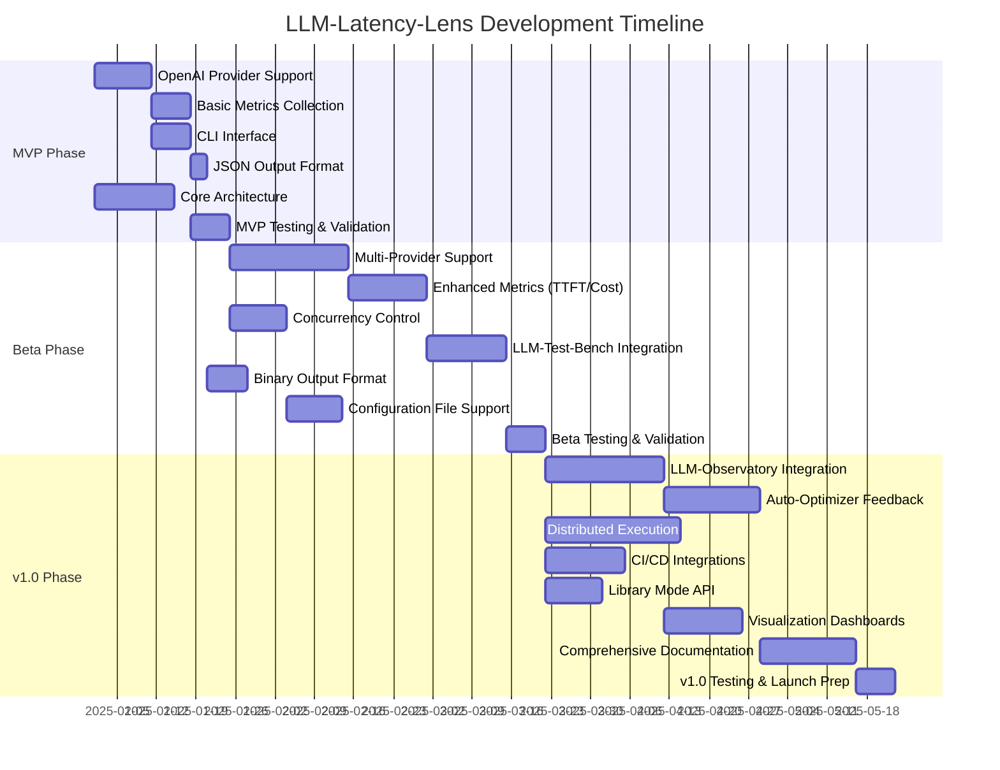
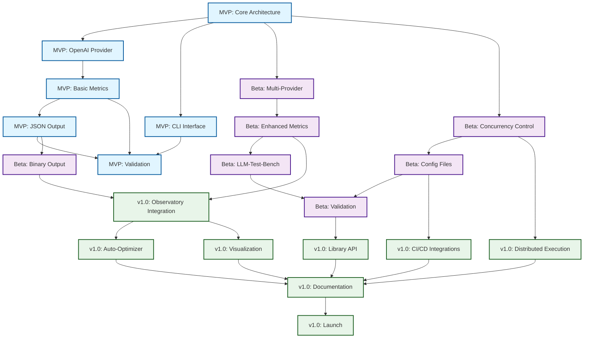

# LLM-Latency-Lens Development Roadmap

## Executive Summary

This document outlines the phased development approach for LLM-Latency-Lens, a comprehensive latency profiling and performance analysis tool for Large Language Models. The roadmap progresses through three major phases: MVP (Minimum Viable Product), Beta Release, and v1.0 Release, with each phase building upon the previous one while maintaining production quality and stability.

**Project Vision:** Create the industry-standard tool for LLM performance profiling, enabling developers to measure, analyze, and optimize latency across all major LLM providers.

---

## Phase 1: MVP (Minimum Viable Product)

**Timeline:** Weeks 1-6 (6 weeks)
**Status:** Foundation Phase
**Goal:** Establish core profiling capabilities with single provider support

### Core Features

#### 1.1 Single Provider Support (OpenAI)
- **Rationale:** OpenAI represents the most widely adopted LLM provider, providing an ideal foundation
- **Components:**
  - OpenAI API client implementation
  - Authentication and API key management
  - Request/response handling with retry logic
  - Error handling and rate limit management
- **Effort:** 1.5 weeks
- **Dependencies:** None

#### 1.2 Basic Metrics Collection
- **Metrics:**
  - End-to-end latency (total request time)
  - Token throughput (tokens/second)
  - Request success/failure rates
  - Response token count
  - Model performance baseline
- **Implementation:**
  - High-resolution timestamp capture
  - Async request tracking
  - Memory-efficient metric storage
- **Effort:** 1 week
- **Dependencies:** 1.1

#### 1.3 CLI Interface
- **Features:**
  - Command-line argument parsing (using yargs or commander)
  - Interactive prompts for configuration
  - Progress indicators for running tests
  - Real-time metric display
  - Color-coded output for status
- **Commands:**
  ```bash
  llm-latency-lens profile --provider openai --model gpt-4 --prompt "test.txt"
  llm-latency-lens analyze --results results.json
  ```
- **Effort:** 1 week
- **Dependencies:** 1.1, 1.2

#### 1.4 JSON Output Format
- **Schema Design:**
  ```json
  {
    "metadata": {
      "version": "1.0.0",
      "timestamp": "ISO8601",
      "provider": "openai",
      "model": "gpt-4"
    },
    "config": {
      "iterations": 100,
      "concurrency": 1,
      "prompt": "..."
    },
    "results": {
      "latency": {
        "mean": 0,
        "median": 0,
        "p95": 0,
        "p99": 0,
        "min": 0,
        "max": 0
      },
      "throughput": {
        "tokens_per_second": 0,
        "requests_per_second": 0
      },
      "reliability": {
        "success_rate": 0,
        "error_count": 0,
        "errors": []
      }
    }
  }
  ```
- **Validation:** JSON schema validation
- **Effort:** 0.5 weeks
- **Dependencies:** 1.2

#### 1.5 Core Architecture
- **Design Patterns:**
  - Strategy pattern for provider implementations
  - Observer pattern for metric collection
  - Factory pattern for metric aggregators
- **Module Structure:**
  ```
  src/
  ├── core/
  │   ├── profiler.ts          # Main profiling engine
  │   ├── metrics.ts           # Metric collection & aggregation
  │   └── types.ts             # Core type definitions
  ├── providers/
  │   ├── base.ts              # Base provider interface
  │   └── openai.ts            # OpenAI implementation
  ├── cli/
  │   ├── commands/            # CLI command handlers
  │   └── display.ts           # Output formatting
  └── utils/
      ├── statistics.ts        # Statistical calculations
      └── validation.ts        # Input validation
  ```
- **Effort:** 2 weeks
- **Dependencies:** None

### Success Criteria

1. **Functional Requirements:**
   - Successfully profile OpenAI GPT-3.5 and GPT-4 models
   - Collect and report all basic metrics with < 1ms measurement overhead
   - Generate valid JSON output for 100% of successful runs
   - CLI completes without errors for valid inputs

2. **Performance Requirements:**
   - Support at least 100 consecutive requests without memory leaks
   - Metric collection overhead < 5% of total request time
   - JSON serialization completes in < 100ms

3. **Reliability Requirements:**
   - Graceful handling of API errors and timeouts
   - 100% test coverage for core profiling logic
   - Zero crashes on valid inputs

### Validation Tests

```typescript
// Test Suite: MVP Validation
describe('MVP Phase Validation', () => {
  test('OpenAI Integration', async () => {
    // Verify successful connection to OpenAI API
    // Measure baseline latency for gpt-3.5-turbo
    // Validate response structure
  });

  test('Metrics Accuracy', () => {
    // Verify statistical calculations (mean, median, percentiles)
    // Test edge cases (single request, timeout scenarios)
    // Validate throughput calculations
  });

  test('CLI Functionality', () => {
    // Test all CLI commands and flags
    // Verify error messages and help text
    // Test invalid input handling
  });

  test('JSON Output', () => {
    // Validate against JSON schema
    // Test serialization of all metric types
    // Verify timestamp format compliance
  });
});
```

### Key Dependencies

- **External:**
  - Node.js >= 18.x (ES modules, performance API)
  - OpenAI SDK >= 4.x
  - TypeScript >= 5.x
  - Jest for testing

- **Internal:**
  - None (greenfield project)

### Risk Analysis

| Risk | Impact | Probability | Mitigation |
|------|--------|-------------|------------|
| OpenAI API changes | High | Medium | Version locking, adapter pattern |
| Rate limiting issues | Medium | High | Exponential backoff, queue management |
| Metric accuracy | High | Low | Rigorous testing, peer review |
| Performance overhead | Medium | Medium | Profiling, optimization iterations |

### Deliverables

1. Working CLI application (llm-latency-lens executable)
2. OpenAI provider implementation
3. Core metrics engine
4. JSON output formatter
5. Unit and integration test suite (>80% coverage)
6. Basic documentation (README with usage examples)
7. Docker container for reproducible testing

---

## Phase 2: Beta Release

**Timeline:** Weeks 7-16 (10 weeks)
**Status:** Expansion Phase
**Goal:** Multi-provider support with enhanced metrics and professional features

### Core Features

#### 2.1 Multi-Provider Support
- **Providers:**
  - Anthropic (Claude 3.5 Sonnet, Opus)
  - Google (Gemini 1.5 Pro/Flash)
  - Cohere (Command R+)
  - Meta (Llama via Together AI / Replicate)
  - Mistral AI
  - OpenRouter (aggregator)
- **Implementation Strategy:**
  - Abstract provider interface
  - Unified credential management
  - Provider-specific optimizations
  - Standardized error handling
- **Effort:** 3 weeks
- **Dependencies:** MVP Phase 1.5 (architecture)

#### 2.2 Enhanced Metrics
- **Time-to-First-Token (TTFT):**
  - Stream initiation latency
  - Network handshake time
  - Server processing time breakdown
- **Cost Tracking:**
  - Per-request cost calculation
  - Monthly cost projection
  - Cost-per-token analysis
  - Provider cost comparison
- **Advanced Performance:**
  - Inter-token latency (ITL)
  - Generation speed variation
  - Context length impact analysis
  - Temperature/parameters effect tracking
- **Effort:** 2 weeks
- **Dependencies:** 2.1

#### 2.3 Concurrency Control
- **Features:**
  - Configurable concurrent request limits
  - Rate limiting compliance
  - Load pattern simulation (burst, sustained, ramp-up)
  - Resource usage monitoring
- **Algorithms:**
  - Token bucket for rate limiting
  - Semaphore for concurrency control
  - Adaptive backoff strategies
- **Effort:** 1.5 weeks
- **Dependencies:** MVP Phase 1.5

#### 2.4 LLM-Test-Bench Integration
- **Capabilities:**
  - Import test scenarios from LLM-Test-Bench
  - Execute benchmark suites
  - Export results to Test-Bench format
  - Automated regression detection
- **Integration Points:**
  - Shared test case format
  - Result comparison API
  - Automated reporting pipeline
- **Effort:** 2 weeks
- **Dependencies:** 2.1, 2.2

#### 2.5 Binary Output Format
- **Format:** Protocol Buffers or MessagePack
- **Benefits:**
  - 70-80% size reduction vs JSON
  - Faster serialization/deserialization
  - Schema evolution support
  - Language-agnostic
- **Effort:** 1 week
- **Dependencies:** MVP Phase 1.4

#### 2.6 Configuration File Support
- **Formats:** YAML, JSON, TOML
- **Configuration Scopes:**
  ```yaml
  # llm-latency-lens.config.yaml
  version: "2.0"

  global:
    output_dir: "./results"
    log_level: "info"

  providers:
    openai:
      api_key: "${OPENAI_API_KEY}"
      org_id: "optional-org-id"
      rate_limit: 60  # requests per minute

    anthropic:
      api_key: "${ANTHROPIC_API_KEY}"
      rate_limit: 50

  profiling:
    default_iterations: 100
    concurrency: 5
    timeout: 30000  # ms
    retry_strategy:
      max_attempts: 3
      backoff: "exponential"

  metrics:
    enabled:
      - latency
      - ttft
      - cost
      - throughput
    percentiles: [50, 90, 95, 99]

  output:
    formats: ["json", "binary"]
    include_raw_data: false
  ```
- **Effort:** 1.5 weeks
- **Dependencies:** All MVP features

### Success Criteria

1. **Functional Requirements:**
   - Successfully profile all 6+ supported providers
   - Accurate TTFT measurement (< 10ms variance)
   - Cost tracking within 1% of provider billing
   - Configuration files support all CLI options

2. **Performance Requirements:**
   - Support up to 50 concurrent requests
   - Process 1000+ requests without degradation
   - Binary format 10x faster than JSON for large datasets

3. **Integration Requirements:**
   - LLM-Test-Bench compatibility for 100% of test cases
   - Automated result import/export workflow

### Validation Tests

```typescript
// Test Suite: Beta Validation
describe('Beta Phase Validation', () => {
  test('Multi-Provider Parity', async () => {
    // Test all providers with identical prompts
    // Verify metric consistency across providers
    // Test provider-specific features
  });

  test('TTFT Accuracy', async () => {
    // Compare TTFT measurements with provider SDKs
    // Test streaming vs non-streaming accuracy
    // Validate timing precision
  });

  test('Cost Calculation', () => {
    // Verify against provider pricing pages
    // Test edge cases (caching, batch discounts)
    // Validate multi-model cost aggregation
  });

  test('Concurrency & Rate Limiting', async () => {
    // Test rate limit compliance
    // Verify concurrency limits enforced
    // Test backoff behavior under load
  });

  test('LLM-Test-Bench Integration', async () => {
    // Import test suite from Test-Bench
    // Execute full benchmark
    // Validate result format compatibility
  });

  test('Configuration Loading', () => {
    // Test YAML/JSON/TOML parsing
    // Validate environment variable substitution
    // Test configuration validation and error reporting
  });
});
```

### Key Dependencies

- **External:**
  - Provider SDKs: @anthropic-ai/sdk, @google/generative-ai, cohere-ai
  - LLM-Test-Bench API
  - protobuf/msgpack libraries
  - yaml/toml parsers

- **Internal:**
  - MVP Phase 1.x (all components)

### Risk Analysis

| Risk | Impact | Probability | Mitigation |
|------|--------|-------------|------------|
| Provider API differences | High | High | Abstraction layer, adapter pattern |
| TTFT measurement variance | Medium | Medium | Multiple timing methods, calibration |
| Cost API changes | Medium | High | Configurable pricing database |
| Test-Bench compatibility | Medium | Low | Version locking, compatibility tests |
| Concurrency race conditions | High | Medium | Thorough async testing, load testing |

### Deliverables

1. Multi-provider profiling engine
2. Enhanced metrics module (TTFT, cost tracking)
3. Concurrency control system
4. LLM-Test-Bench integration
5. Binary output format support
6. Configuration file system
7. Expanded test suite (>85% coverage)
8. User documentation and provider guides
9. Docker compose setup with all providers

---

## Phase 3: v1.0 Release

**Timeline:** Weeks 17-28 (12 weeks)
**Status:** Production-Ready Platform
**Goal:** Enterprise-grade distributed profiling with ecosystem integrations

### Core Features

#### 3.1 LLM-Observatory Integration
- **Features:**
  - Real-time metric streaming to Observatory
  - Historical trend analysis
  - Multi-project dashboards
  - Anomaly detection alerts
- **Implementation:**
  - WebSocket/gRPC streaming protocol
  - Time-series data optimization
  - Query API for historical data
- **Effort:** 3 weeks
- **Dependencies:** Beta Phase 2.2, 2.5

#### 3.2 LLM-Auto-Optimizer Feedback Loops
- **Capabilities:**
  - Automatic parameter tuning based on latency profiles
  - Model selection recommendations
  - Provider switching strategies
  - Cost-performance optimization
- **Optimization Strategies:**
  - Bayesian optimization for hyperparameters
  - Multi-objective optimization (latency + cost + quality)
  - A/B testing framework
- **Effort:** 2.5 weeks
- **Dependencies:** Beta Phase 2.2, 3.1

#### 3.3 Distributed Execution Support
- **Architecture:**
  - Master-worker coordination
  - Distributed task queue (Redis/RabbitMQ)
  - Result aggregation service
  - Geographic distribution support
- **Features:**
  - Horizontal scaling to 1000+ concurrent requests
  - Multi-region latency testing
  - Load balancing across workers
  - Fault tolerance and recovery
- **Effort:** 3.5 weeks
- **Dependencies:** Beta Phase 2.3

#### 3.4 CI/CD Integrations
- **GitHub Actions:**
  ```yaml
  - name: LLM Latency Profiling
    uses: llm-latency-lens/action@v1
    with:
      providers: 'openai,anthropic'
      threshold_p95: 2000  # ms
      fail_on_regression: true
  ```
- **GitLab CI:**
  - Native GitLab integration
  - Merge request latency reports
  - Automated performance gates
- **Jenkins Plugin:**
  - Pipeline integration
  - Historical trend visualization
- **Effort:** 2 weeks
- **Dependencies:** Beta Phase 2.6

#### 3.5 Library Mode API
- **Usage:**
  ```typescript
  import { LatencyProfiler } from 'llm-latency-lens';

  const profiler = new LatencyProfiler({
    provider: 'openai',
    model: 'gpt-4',
  });

  const results = await profiler.profile({
    prompt: 'Hello, world!',
    iterations: 100,
  });

  console.log(results.latency.p95); // Access metrics programmatically
  ```
- **Features:**
  - Promise-based API
  - Event emitters for real-time updates
  - Typed TypeScript definitions
  - Browser and Node.js support
- **Effort:** 1.5 weeks
- **Dependencies:** All Beta features

#### 3.6 Visualization Dashboard Hooks
- **Integrations:**
  - Grafana datasource plugin
  - Prometheus exporter
  - Custom webhook support
  - Datadog integration
- **Visualizations:**
  - Latency heatmaps
  - Cost trending charts
  - Provider comparison tables
  - Real-time monitoring dashboards
- **Effort:** 2 weeks
- **Dependencies:** 3.1, Beta Phase 2.5

#### 3.7 Comprehensive Documentation
- **Content:**
  - Architecture deep-dive
  - Provider integration guides
  - API reference (auto-generated)
  - Best practices and patterns
  - Troubleshooting guide
  - Video tutorials
  - Example projects repository
- **Platforms:**
  - Documentation site (VitePress/Docusaurus)
  - Interactive examples (CodeSandbox)
  - API documentation (TypeDoc)
- **Effort:** 2.5 weeks
- **Dependencies:** All v1.0 features

### Success Criteria

1. **Functional Requirements:**
   - Observatory integration streaming 100+ metrics/second
   - Auto-Optimizer reduces latency by 15%+ in benchmarks
   - Distributed execution scales linearly to 10+ workers
   - CI/CD integrations work in all three platforms

2. **Performance Requirements:**
   - Support 10,000+ requests/hour distributed load
   - Master-worker coordination latency < 50ms
   - API library overhead < 1ms per call

3. **Enterprise Requirements:**
   - 99.9% uptime for distributed coordinator
   - Security audit passed (dependency scanning, SAST)
   - SOC 2 compliance documentation ready

### Validation Tests

```typescript
// Test Suite: v1.0 Production Readiness
describe('v1.0 Production Validation', () => {
  test('Observatory Integration', async () => {
    // Test metric streaming throughput
    // Verify data consistency
    // Test reconnection logic
  });

  test('Auto-Optimizer Effectiveness', async () => {
    // Benchmark baseline performance
    // Run optimizer for 100 iterations
    // Verify latency improvement > 10%
  });

  test('Distributed Execution', async () => {
    // Spawn 10 workers
    // Execute 10,000 requests
    // Verify result correctness and aggregation
  });

  test('CI/CD Integration', () => {
    // Test GitHub Actions workflow
    // Verify threshold enforcement
    // Test failure scenarios
  });

  test('Library API', () => {
    // Test all public API methods
    // Verify TypeScript types
    // Test error handling
  });

  test('Visualization Integrations', async () => {
    // Test Grafana datasource queries
    // Verify Prometheus metrics format
    // Test webhook delivery
  });

  test('Load & Stress Testing', async () => {
    // 1 hour sustained load test
    // Memory leak detection
    // Recovery from failures
  });
});
```

### Key Dependencies

- **External:**
  - LLM-Observatory API
  - LLM-Auto-Optimizer SDK
  - Redis/RabbitMQ for distributed queue
  - Grafana plugin SDK
  - CI/CD platform SDKs

- **Internal:**
  - MVP Phase 1.x (all)
  - Beta Phase 2.x (all)

### Risk Analysis

| Risk | Impact | Probability | Mitigation |
|------|--------|-------------|------------|
| Observatory API changes | Medium | Low | API versioning, backward compatibility |
| Distributed system complexity | High | High | Extensive testing, chaos engineering |
| CI/CD platform compatibility | Medium | Medium | Platform-specific test environments |
| Security vulnerabilities | Critical | Low | Regular audits, dependency scanning |
| Performance at scale | High | Medium | Load testing, performance budgets |

### Deliverables

1. LLM-Observatory integration module
2. LLM-Auto-Optimizer feedback system
3. Distributed execution framework
4. CI/CD platform integrations (GitHub, GitLab, Jenkins)
5. Library mode API with TypeScript definitions
6. Visualization dashboard integrations
7. Comprehensive documentation site
8. Production deployment guides
9. Security audit report
10. Performance benchmark suite
11. Example projects and templates
12. Migration guides from Beta to v1.0

---

## Gantt Chart



---

## Dependency Graph



---

## Critical Path Analysis

### Critical Path (MVP to v1.0)
The longest path determining minimum project duration:

```
1. Core Architecture (2 weeks)
2. OpenAI Provider (1.5 weeks)
3. Basic Metrics (1 week)
4. MVP Validation (1 week)
5. Multi-Provider Support (3 weeks)
6. Enhanced Metrics (2 weeks)
7. LLM-Test-Bench Integration (2 weeks)
8. Beta Validation (1 week)
9. LLM-Observatory Integration (3 weeks)
10. Auto-Optimizer Feedback (2.5 weeks)
11. Documentation (2.5 weeks)
12. v1.0 Launch (1 week)

Total Critical Path: 22.5 weeks (~5.5 months)
```

### Parallel Development Opportunities

- **MVP Phase:** CLI Interface can be developed in parallel with provider implementation
- **Beta Phase:** Concurrency control, binary format, and config files can be parallelized
- **v1.0 Phase:** Distributed execution, CI/CD integrations, and library API can run concurrently

### Resource Optimization

Assuming 2-3 developers:
- **Total duration with parallelization:** 28 weeks (~7 months)
- **Single developer (sequential):** 40+ weeks (~10 months)
- **Recommended team size:** 2 full-stack engineers + 1 DevOps engineer (part-time)

---

## Phase Transition Criteria

### MVP → Beta Transition

**Technical Validation:**
- [ ] 100% passing unit tests (>80% coverage)
- [ ] OpenAI integration tested with GPT-3.5 and GPT-4
- [ ] CLI handles all error cases gracefully
- [ ] JSON schema validated with 10,000+ test cases
- [ ] Performance benchmark: 100 requests in < 2 minutes
- [ ] Memory usage stable over 1000+ requests
- [ ] Docker image builds successfully
- [ ] Basic documentation complete

**Business Validation:**
- [ ] At least 5 alpha testers providing feedback
- [ ] Core use case validated (single-provider profiling)
- [ ] No critical bugs in issue tracker

**Go/No-Go Decision Criteria:**
- All technical validation items complete
- Product owner approval
- Security scan passed (no critical vulnerabilities)

---

### Beta → v1.0 Transition

**Technical Validation:**
- [ ] All 6+ providers integrated and tested
- [ ] TTFT accuracy within 10ms of SDK measurements
- [ ] Cost calculation accuracy > 99%
- [ ] LLM-Test-Bench integration passes full benchmark suite
- [ ] Concurrency handles 50+ parallel requests
- [ ] Configuration file support for all features
- [ ] Binary format 10x faster than JSON
- [ ] Test coverage > 85%
- [ ] Load test: 1000 requests without degradation
- [ ] Documentation for all providers

**Business Validation:**
- [ ] 50+ beta users actively testing
- [ ] At least 3 production deployments
- [ ] GitHub stars > 100
- [ ] Feature parity with major competitors

**Go/No-Go Decision Criteria:**
- Zero critical bugs
- Performance benchmarks met
- User feedback positive (NPS > 30)
- Legal review complete (licensing, compliance)

---

### v1.0 Launch Criteria

**Technical Validation:**
- [ ] Observatory integration streams 100+ metrics/second
- [ ] Auto-Optimizer improves performance by 15%+
- [ ] Distributed execution scales to 10+ workers
- [ ] CI/CD integrations work in GitHub, GitLab, Jenkins
- [ ] Library API stable and documented
- [ ] Visualization integrations tested (Grafana, Prometheus)
- [ ] Test coverage > 90%
- [ ] Load test: 10,000 requests/hour for 24 hours
- [ ] Security audit passed
- [ ] Performance regression test suite complete

**Business Validation:**
- [ ] 500+ users across MVP and Beta
- [ ] At least 10 production deployments
- [ ] Case studies from 3+ companies
- [ ] Blog post and announcement ready
- [ ] Community support channels established

**Launch Requirements:**
- Comprehensive documentation site live
- Video tutorials published
- npm package published (stable version)
- Docker Hub images available
- Release notes finalized
- Marketing materials ready
- Support plan defined

---

## Risk Register & Mitigation Strategies

### High Impact Risks

| Risk ID | Description | Impact | Probability | Mitigation Strategy | Owner |
|---------|-------------|--------|-------------|---------------------|-------|
| R-001 | Provider API breaking changes | Critical | Medium | - Version locking<br>- Adapter pattern<br>- Automated compatibility tests<br>- Provider SDK version matrix | Tech Lead |
| R-002 | Distributed system complexity exceeds team capability | High | High | - Start with simple master-worker<br>- Use proven message queue (Redis/RabbitMQ)<br>- Hire distributed systems consultant<br>- Chaos engineering testing | Architecture Lead |
| R-003 | Performance degradation at scale | High | Medium | - Early load testing (Beta phase)<br>- Performance budgets per feature<br>- Continuous benchmarking<br>- Optimization sprints | DevOps Engineer |
| R-004 | Security vulnerabilities | Critical | Low | - Regular dependency scanning<br>- SAST/DAST in CI/CD<br>- Third-party security audit<br>- Bug bounty program | Security Lead |
| R-005 | LLM-Observatory/Auto-Optimizer API instability | Medium | Medium | - Early integration testing<br>- API contract testing<br>- Fallback modes<br>- Regular sync with those teams | Integration Lead |

### Medium Impact Risks

| Risk ID | Description | Impact | Probability | Mitigation Strategy |
|---------|-------------|--------|-------------|---------------------|
| R-006 | TTFT measurement inconsistency | Medium | Medium | - Multiple timing methods<br>- Calibration against provider SDKs<br>- Statistical validation |
| R-007 | Cost calculation discrepancies | Medium | High | - Configurable pricing database<br>- Weekly pricing updates<br>- User override capability |
| R-008 | LLM-Test-Bench compatibility issues | Medium | Low | - Weekly integration tests<br>- Version compatibility matrix<br>- Backward compatibility |
| R-009 | CI/CD platform API changes | Medium | Medium | - Platform-agnostic core<br>- Platform-specific adapter layers<br>- Version pinning |
| R-010 | Documentation falling behind features | Low | High | - Docs-as-code approach<br>- Automated API documentation<br>- Documentation sprints |

### Contingency Plans

**If Critical Path Delay Occurs:**
1. **MVP Phase Delay (>2 weeks):**
   - Reduce provider testing scope
   - Defer advanced error handling to Beta
   - Simplify initial metrics

2. **Beta Phase Delay (>3 weeks):**
   - Reduce provider count (focus on top 4)
   - Defer binary format to v1.0
   - Simplify LLM-Test-Bench integration

3. **v1.0 Phase Delay (>4 weeks):**
   - Release v1.0 without distributed execution (defer to v1.1)
   - Simplify CI/CD integrations (GitHub Actions only)
   - Reduce visualization integrations

**If Key Person Leaves:**
- Knowledge transfer protocol (2-week overlap)
- Documentation of all major architectural decisions
- Bus factor mitigation: pair programming on critical components

---

## Resource Planning

### Team Structure

**MVP Phase (Weeks 1-6):**
- 1 Full-Stack Engineer (Lead) - 100%
- 1 Full-Stack Engineer - 100%
- 1 DevOps Engineer - 25%

**Beta Phase (Weeks 7-16):**
- 1 Full-Stack Engineer (Lead) - 100%
- 2 Full-Stack Engineers - 100%
- 1 DevOps Engineer - 50%
- 1 Technical Writer - 25%

**v1.0 Phase (Weeks 17-28):**
- 1 Full-Stack Engineer (Lead) - 100%
- 2 Full-Stack Engineers - 100%
- 1 DevOps Engineer - 75%
- 1 Technical Writer - 50%
- 1 QA Engineer - 50%

### Budget Estimates

**Development Costs:**
- Salaries (7 months, blended rate): $280,000
- Infrastructure (AWS/GCP): $5,000
- LLM API costs (testing): $10,000
- Third-party services (CI/CD, monitoring): $3,000
- Security audit: $15,000
- **Total Development:** ~$313,000

**Ongoing Costs (Annual):**
- Infrastructure: $12,000
- LLM API costs: $50,000
- Maintenance (2 engineers, 20%): $80,000
- **Total Annual:** ~$142,000

---

## Success Metrics

### Adoption Metrics
- **MVP:** 50 users, 10 GitHub stars
- **Beta:** 500 users, 100 GitHub stars, 5 production deployments
- **v1.0:** 5,000 users, 1,000 GitHub stars, 50 production deployments

### Performance Metrics
- **Measurement Accuracy:** < 10ms variance from provider SDKs
- **Throughput:** 10,000 requests/hour (distributed mode)
- **Reliability:** 99.9% uptime for distributed coordinator
- **Overhead:** < 5% measurement overhead

### Quality Metrics
- **Test Coverage:** 80% (MVP) → 85% (Beta) → 90% (v1.0)
- **Bug Density:** < 1 critical bug per 1000 LOC
- **Mean Time to Resolution:** < 48 hours for critical bugs
- **User Satisfaction:** NPS > 30 (Beta), NPS > 50 (v1.0)

### Business Metrics
- **Time to First Value:** < 15 minutes (install → first profile)
- **Integration Rate:** 80% of users integrate with CI/CD by v1.0
- **Retention:** 60% monthly active users (v1.0)
- **Market Share:** Top 3 LLM profiling tool by downloads

---

## Maintenance & Post-Launch

### v1.0 Launch + 6 Months Roadmap

**Months 1-2: Stabilization**
- Bug fixes and performance optimization
- User feedback incorporation
- Documentation improvements
- Community building (Discord, forum)

**Months 3-4: Feature Enhancements**
- Additional provider support (Azure OpenAI, AWS Bedrock)
- Advanced visualization features
- Enhanced Auto-Optimizer algorithms
- Cost optimization recommendations

**Months 5-6: Ecosystem Growth**
- Terraform/CloudFormation templates
- Kubernetes operator
- SaaS offering (hosted profiling)
- Enterprise features (SSO, RBAC, audit logs)

### Long-Term Vision (v2.0+)

- **Intelligent Profiling:** ML-based anomaly detection and predictive analytics
- **Multi-Modal Support:** Vision models, audio models profiling
- **Cross-Provider Orchestration:** Automatic failover and load balancing
- **Real-Time Optimization:** Sub-second parameter tuning
- **Global Performance Network:** Crowdsourced latency data across regions

---

## Conclusion

This roadmap provides a structured path from MVP to production-ready v1.0 release over approximately 7 months. The phased approach ensures:

1. **Rapid Validation:** MVP in 6 weeks provides early user feedback
2. **Incremental Value:** Each phase delivers production-ready capabilities
3. **Risk Mitigation:** Extensive testing and validation gates between phases
4. **Scalability:** Architecture supports future growth and ecosystem integrations

**Key Success Factors:**
- Disciplined execution of validation criteria
- Regular stakeholder communication
- Proactive risk management
- Focus on performance and reliability from day one
- Strong community engagement

**Next Steps:**
1. Finalize team structure and hiring plan
2. Set up development environment and CI/CD pipeline
3. Kick off MVP Phase Week 1: Core Architecture design
4. Establish weekly progress reviews and retrospectives

---

**Document Version:** 1.0
**Last Updated:** 2025-11-07
**Maintained By:** Product & Engineering Leadership
**Review Cycle:** Bi-weekly during development, monthly post-launch
