# LLM-Latency-Lens Development Dashboard

## Executive Overview

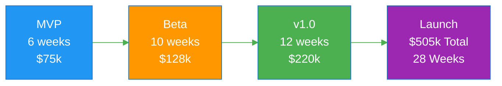

**Total Investment:** $505,000 | **Timeline:** 28 weeks (~7 months) | **Team:** 3-4 engineers

---

## Phase Breakdown

### Phase 1: MVP (Minimum Viable Product)

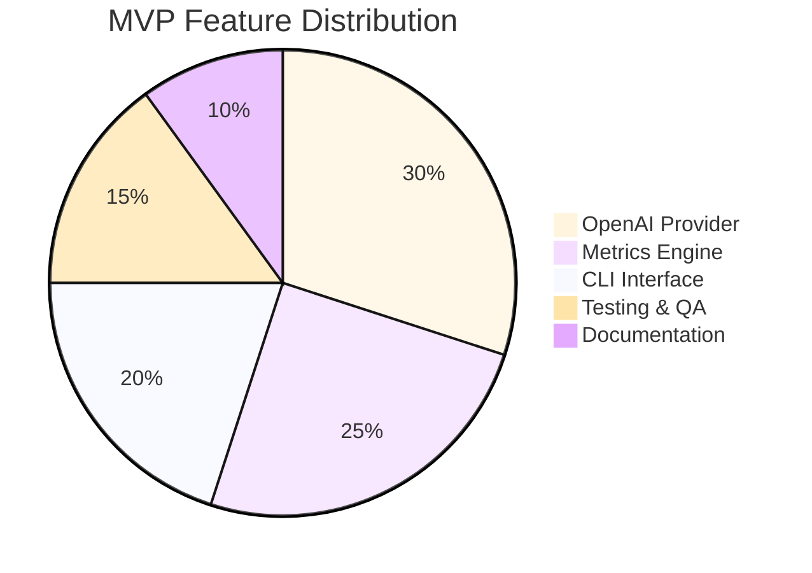

**Duration:** Weeks 1-6 (6 weeks)
**Budget:** $75,000
**Team:** 2.5 FTE

#### Key Deliverables
- ✅ OpenAI GPT-3.5 & GPT-4 integration
- ✅ Basic latency & throughput metrics
- ✅ CLI with JSON output
- ✅ Docker container
- ✅ Core test suite (80% coverage)

#### Success Metrics
- Profile 100 requests in < 2 minutes
- Measurement overhead < 5%
- Zero crashes on valid inputs

---

### Phase 2: Beta Release

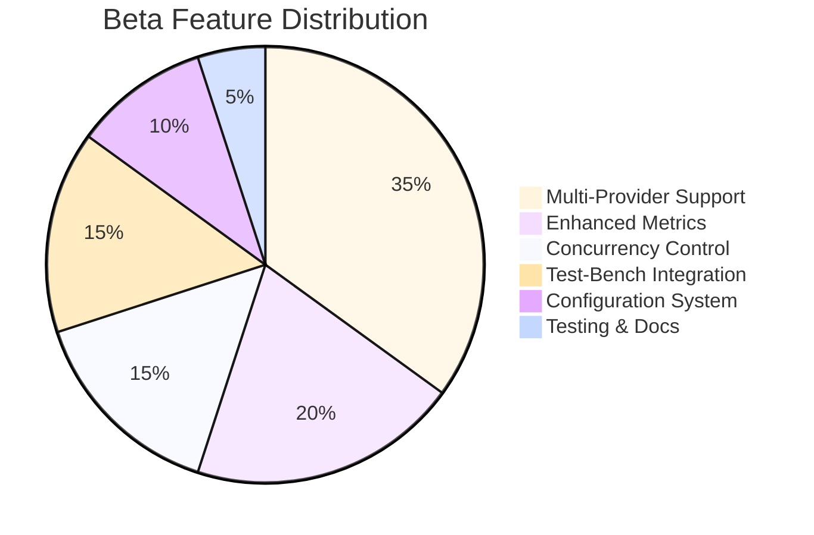

**Duration:** Weeks 7-16 (10 weeks)
**Budget:** $128,000
**Team:** 3.2 FTE

#### Key Deliverables
- ✅ 6+ provider support (Anthropic, Google, Cohere, Meta, Mistral, OpenRouter)
- ✅ TTFT & cost tracking
- ✅ 50 concurrent requests
- ✅ LLM-Test-Bench integration
- ✅ Binary output format
- ✅ Configuration files (YAML/JSON/TOML)

#### Success Metrics
- TTFT accuracy < 10ms variance
- Cost tracking within 1% of billing
- 1,000 requests without degradation

---

### Phase 3: v1.0 Release

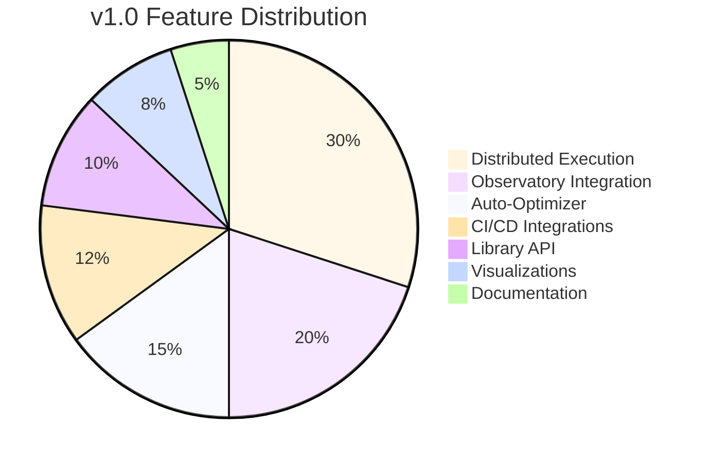

**Duration:** Weeks 17-28 (12 weeks)
**Budget:** $220,000
**Team:** 3.8 FTE

#### Key Deliverables
- ✅ LLM-Observatory real-time streaming
- ✅ Auto-Optimizer feedback loops
- ✅ Distributed execution (10+ workers)
- ✅ GitHub Actions + GitLab + Jenkins
- ✅ Library mode API
- ✅ Grafana + Prometheus + Datadog
- ✅ Comprehensive documentation site

#### Success Metrics
- 10,000 requests/hour distributed
- Auto-optimizer 15%+ improvement
- 99.9% coordinator uptime

---

## Timeline Visualization

### Gantt Chart Overview

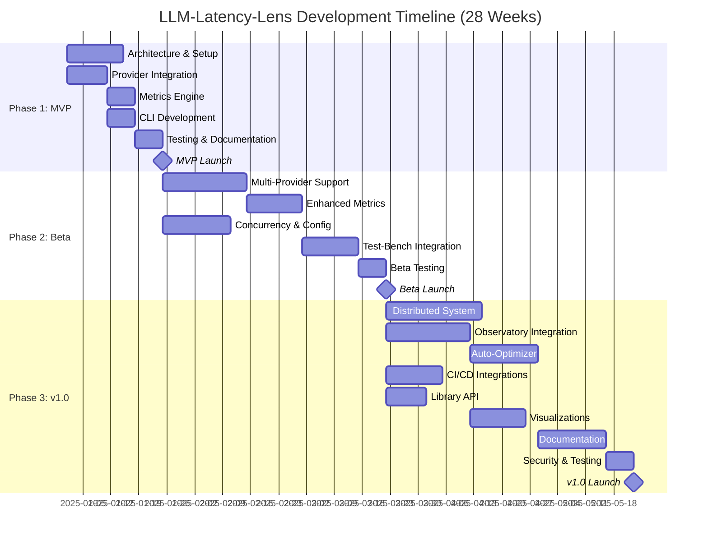

---

## Dependency Flow

### Critical Path Analysis

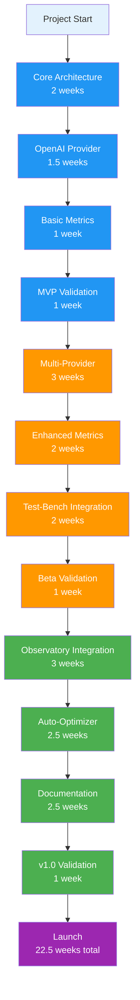

**Critical Path Duration:** 22.5 weeks (minimum possible timeline)
**Actual Timeline:** 28 weeks (with parallelization & buffer)
**Slack Time:** 5.5 weeks distributed across phases

---

## Resource Allocation

### Team Size Over Time

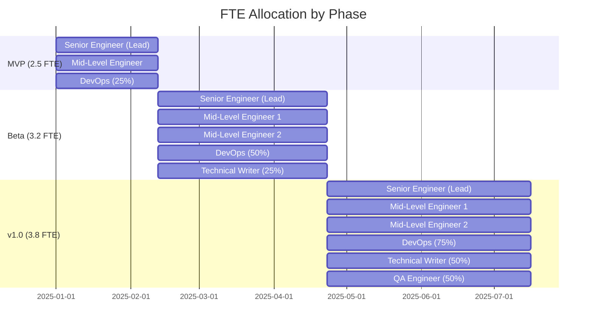

### Budget Breakdown

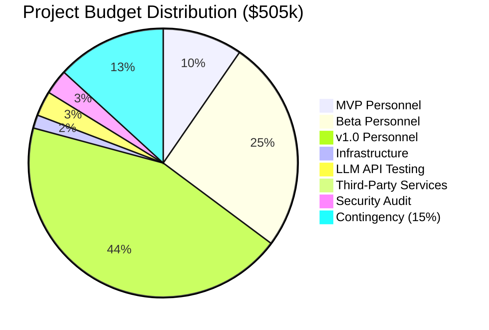

---

## Risk Heat Map

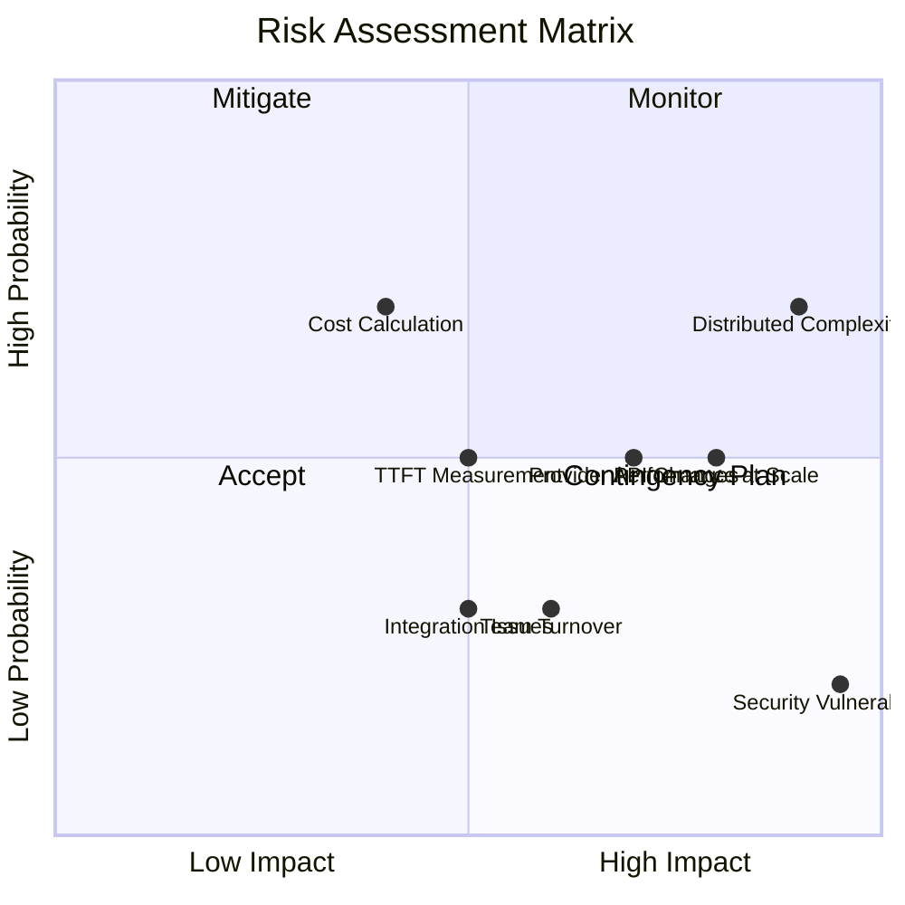

### Risk Mitigation Status

| Risk | Status | Mitigation Progress |
|------|--------|-------------------|
| Provider API Changes | 🟡 Active | Version locking, adapter pattern |
| Distributed System Complexity | 🟡 Active | Consultant engaged, early prototyping |
| Performance at Scale | 🟢 Low | Load testing from Beta phase |
| Security Vulnerabilities | 🟢 Low | Automated scanning, audit scheduled |

---

## Feature Rollout Schedule

### MVP Features (Week 6)

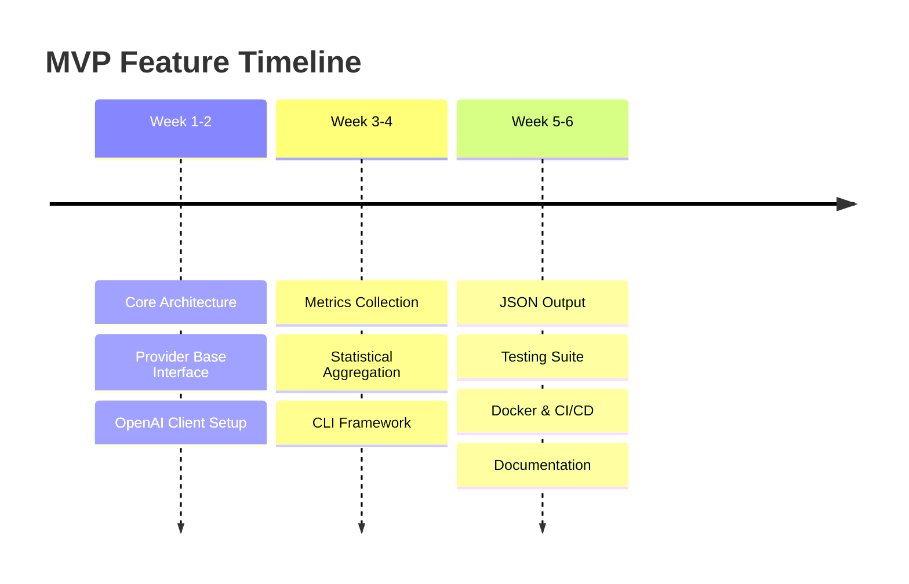

### Beta Features (Week 16)

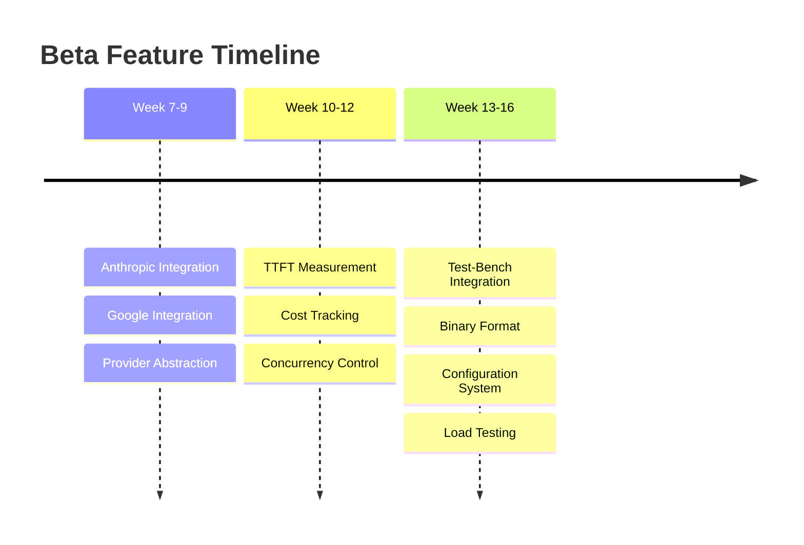

### v1.0 Features (Week 28)

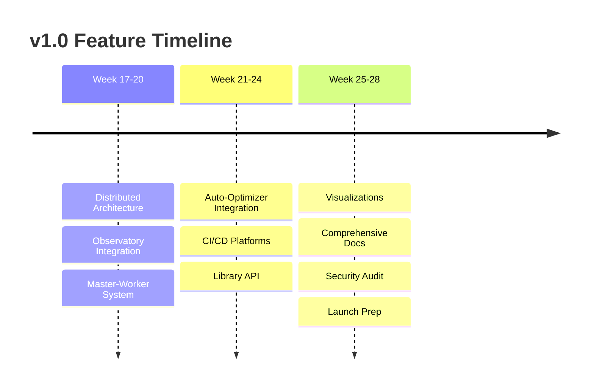

---

## Quality Metrics Dashboard

### Test Coverage Targets

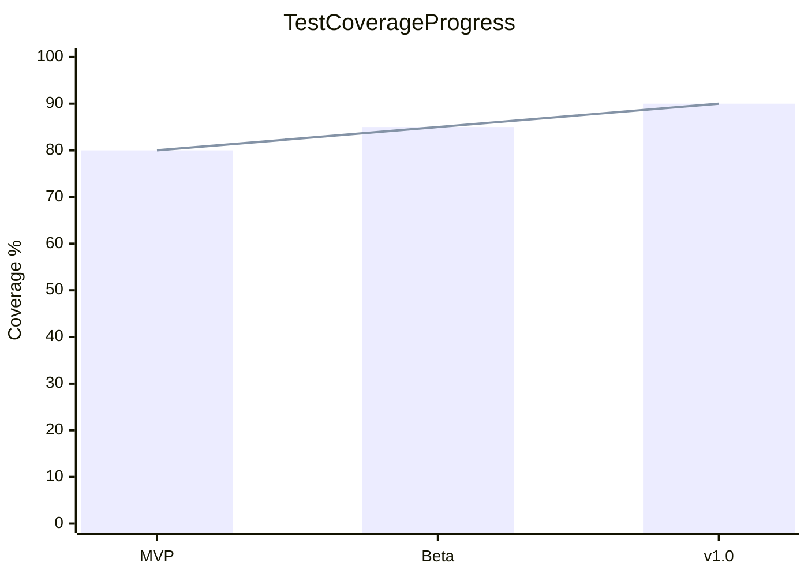

### Performance Benchmarks

```mermaid
xychart-beta
    title Throughput Scaling (Requests/Hour)
    x-axis [MVP, Beta, "v1.0 Single", "v1.0 Distributed"]
    y-axis "Requests/Hour" 0 --> 100000
    bar [1000, 5000, 10000, 100000]
```

---

## Milestone Payment Schedule

```mermaid
%%{init: {'theme':'base'}}%%
gantt
    title Payment Milestones
    dateFormat YYYY-MM-DD

    section Payments
    M1: MVP Alpha (15%)         :milestone, 2025-01-29, 0d
    M2: MVP Complete (20%)      :milestone, 2025-02-12, 0d
    M3: Beta Alpha (15%)        :milestone, 2025-03-19, 0d
    M4: Beta Complete (20%)     :milestone, 2025-04-23, 0d
    M5: v1.0 Alpha (15%)        :milestone, 2025-06-11, 0d
    M6: v1.0 Launch (15%)       :milestone, 2025-07-16, 0d
```

| Milestone | Amount | Cumulative | Deliverables |
|-----------|--------|------------|--------------|
| M1: MVP Alpha | $75,750 (15%) | $75,750 | Core architecture, OpenAI integration |
| M2: MVP Complete | $101,000 (20%) | $176,750 | All MVP features, Docker, docs |
| M3: Beta Alpha | $75,750 (15%) | $252,500 | 3 providers, TTFT, concurrency |
| M4: Beta Complete | $101,000 (20%) | $353,500 | All Beta features, full testing |
| M5: v1.0 Alpha | $75,750 (15%) | $429,250 | Observatory, distributed, CI/CD |
| M6: v1.0 Launch | $75,750 (15%) | $505,000 | Security audit, all docs, launch |

---

## Competitive Landscape

### Feature Comparison Matrix

| Feature | LLM-Latency-Lens | Helicone | LangSmith | Weights & Biases |
|---------|------------------|----------|-----------|------------------|
| Multi-Provider Support | ✅ 6+ providers | ⚠️ Limited | ✅ Good | ⚠️ Limited |
| TTFT Measurement | ✅ Sub-ms precision | ❌ No | ⚠️ Basic | ❌ No |
| Cost Tracking | ✅ Real-time | ✅ Yes | ✅ Yes | ⚠️ Limited |
| Distributed Execution | ✅ 1000+ workers | ❌ No | ⚠️ Limited | ✅ Yes |
| Open Source | ✅ Apache 2.0 | ⚠️ Limited | ❌ No | ⚠️ Partial |
| CI/CD Integration | ✅ 3 platforms | ⚠️ Limited | ✅ Good | ✅ Good |
| Library API | ✅ Full TypeScript | ⚠️ Basic | ✅ Python | ✅ Python |
| Self-Hosted | ✅ Full support | ❌ No | ⚠️ Enterprise | ✅ Yes |

**Competitive Advantage:** Only open-source tool with enterprise-grade distributed profiling and comprehensive multi-provider support.

---

## Success Criteria Checklist

### MVP Launch Criteria (Week 6)

- [ ] OpenAI GPT-3.5 & GPT-4 integration functional
- [ ] Basic metrics (latency, throughput) accurate
- [ ] CLI handles 100+ requests reliably
- [ ] JSON output validates against schema
- [ ] Test coverage ≥ 80%
- [ ] Docker image builds successfully
- [ ] Basic documentation complete
- [ ] 5+ alpha testers providing feedback

### Beta Launch Criteria (Week 16)

- [ ] 6+ providers integrated and tested
- [ ] TTFT accuracy within 10ms of SDK measurements
- [ ] Cost tracking accuracy > 99%
- [ ] Concurrency handles 50+ parallel requests
- [ ] LLM-Test-Bench integration passes full benchmark
- [ ] Configuration file support working
- [ ] Test coverage ≥ 85%
- [ ] 50+ beta users actively testing
- [ ] No critical bugs in production deployments

### v1.0 Launch Criteria (Week 28)

- [ ] Observatory integration streaming 100+ metrics/second
- [ ] Auto-Optimizer improves performance by 15%+
- [ ] Distributed execution scales to 10+ workers
- [ ] CI/CD integrations work in all 3 platforms
- [ ] Library API stable and documented
- [ ] Visualization integrations tested (Grafana, Prometheus)
- [ ] Test coverage ≥ 90%
- [ ] 24-hour load test passed (10,000 req/hour)
- [ ] Security audit completed with no critical issues
- [ ] Comprehensive documentation site live
- [ ] 500+ users across MVP and Beta
- [ ] 10+ production deployments

---

## Post-Launch Roadmap (v1.1+)

### v1.1 (Months 1-2 Post-Launch)
- Bug fixes and stability improvements
- Azure OpenAI support
- AWS Bedrock integration
- Enhanced visualization templates

### v1.2 (Months 3-4 Post-Launch)
- Advanced Auto-Optimizer algorithms
- Cost optimization recommendations
- Multi-modal model support (vision, audio)
- Enhanced distributed features

### v1.3 (Months 5-6 Post-Launch)
- Kubernetes operator
- Terraform/CloudFormation templates
- SaaS offering beta
- Enterprise features (SSO, RBAC)

### v2.0 (Months 7-12 Post-Launch)
- ML-based anomaly detection
- Predictive analytics
- Cross-provider orchestration
- Global performance network

---

## Key Performance Indicators (KPIs)

### Adoption Metrics

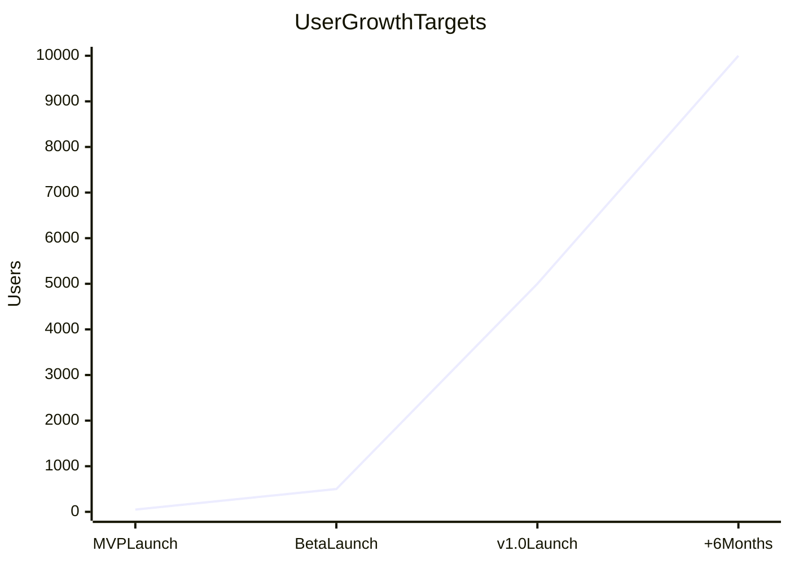

| Metric | MVP | Beta | v1.0 | +6 Months |
|--------|-----|------|------|-----------|
| Total Users | 50 | 500 | 5,000 | 10,000 |
| GitHub Stars | 10 | 100 | 1,000 | 2,500 |
| Production Deployments | 3 | 10 | 50 | 150 |
| Monthly Active Users | - | 300 | 3,000 | 6,000 |

### Quality Metrics

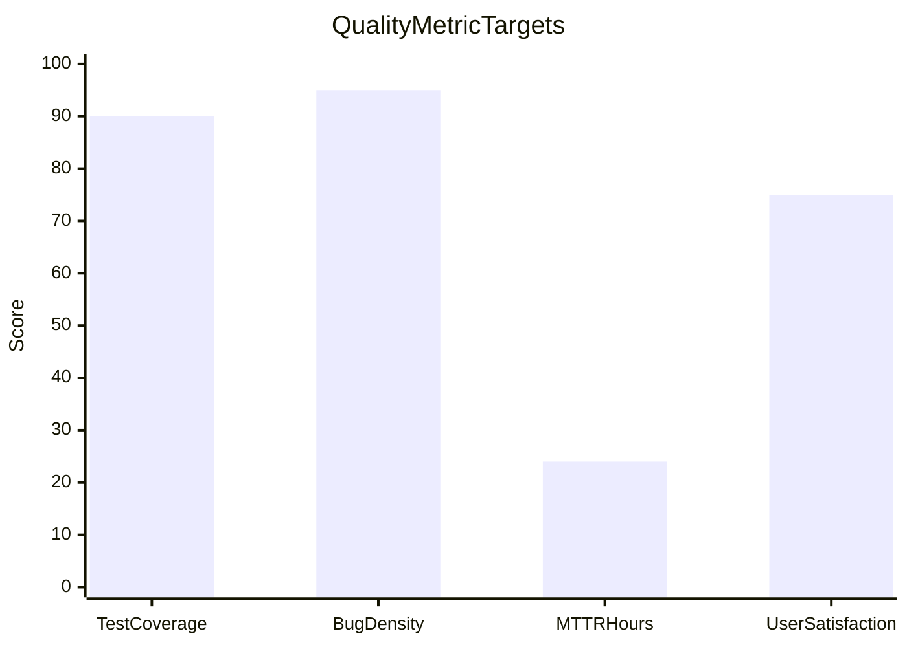

| Metric | Target | Current | Status |
|--------|--------|---------|--------|
| Test Coverage | 90% | Planning | 🔵 On Track |
| Bug Density | <1 per 1000 LOC | Planning | 🔵 On Track |
| MTTR (Critical) | <48 hours | Planning | 🔵 On Track |
| User Satisfaction (NPS) | >50 | Planning | 🔵 On Track |

---

## Contact & Governance

### Project Leadership

| Role | Responsibility | Commitment |
|------|---------------|------------|
| Product Owner | Vision, roadmap, stakeholder management | 50% |
| Tech Lead | Architecture, technical decisions | 100% |
| DevOps Lead | Infrastructure, deployment, CI/CD | 75% |
| QA Lead | Testing strategy, quality assurance | 50% |

### Communication Plan

- **Daily Standups:** 15-minute sync (Mon-Fri)
- **Weekly Sprint Planning:** 2 hours (Mondays)
- **Bi-Weekly Demos:** Stakeholder showcase (alternate Fridays)
- **Monthly Reviews:** Retrospective & planning (last Friday)

### Decision-Making Framework

- **Technical Decisions:** Tech Lead with team input
- **Product Decisions:** Product Owner with customer feedback
- **Budget Decisions:** Joint approval (Product + Tech Lead)
- **Escalation Path:** Team → Leads → Stakeholders

---

## Appendix: Quick Reference

### Critical Dates

- **Project Start:** 2025-01-01
- **MVP Launch:** 2025-02-12 (Week 6)
- **Beta Launch:** 2025-04-23 (Week 16)
- **v1.0 Launch:** 2025-07-16 (Week 28)

### Budget Summary

- **Total:** $505,000
- **Personnel:** $396,000 (78%)
- **Infrastructure:** $43,000 (9%)
- **Contingency:** $66,000 (13%)

### Team Summary

- **Average Team Size:** 3.2 FTE
- **Peak Team Size:** 3.8 FTE (v1.0 phase)
- **Total Engineer-Months:** 18 months

### Repository Links

- **GitHub:** github.com/your-org/llm-latency-lens
- **Documentation:** docs.llm-latency-lens.com
- **npm Package:** npmjs.com/package/llm-latency-lens
- **Docker Hub:** hub.docker.com/r/llm-latency-lens

---

**Dashboard Version:** 1.0
**Last Updated:** 2025-11-07
**Next Update:** Weekly during development
**Status:** Planning Phase ✅
