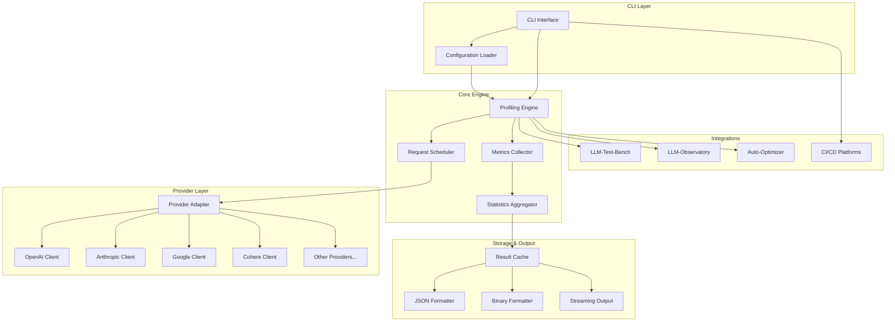
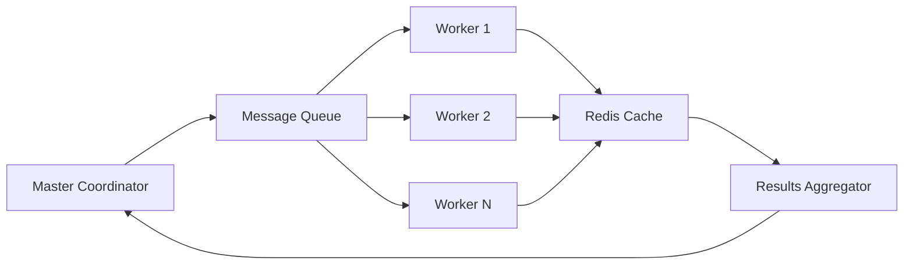
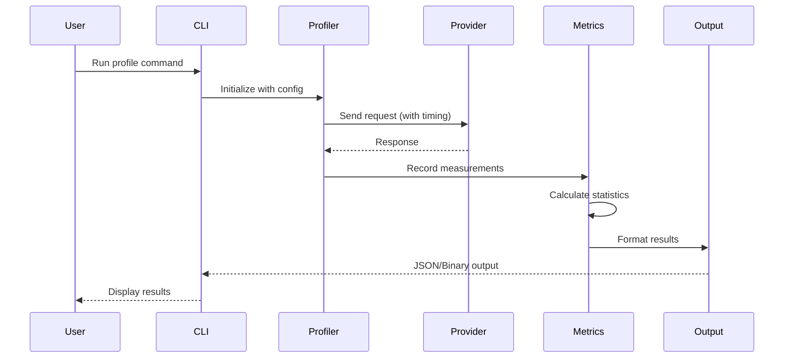
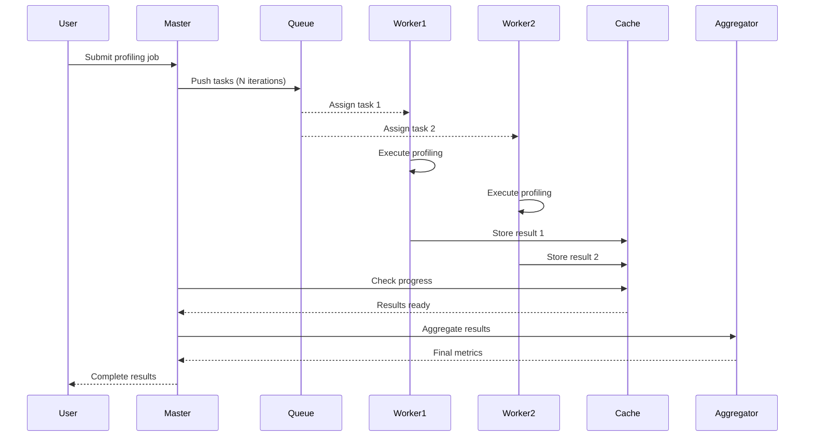
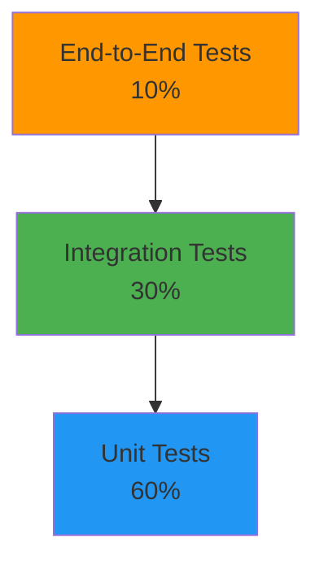

# LLM-Latency-Lens Technical Specifications

## System Architecture

### High-Level Architecture



### Component Specifications

#### 1. Profiling Engine

**Responsibility:** Core orchestration of profiling operations

**Interface:**
```typescript
interface ProfilingEngine {
  configure(config: ProfilingConfig): void;
  profile(request: ProfileRequest): Promise<ProfileResult>;
  batch(requests: ProfileRequest[]): AsyncIterator<ProfileResult>;
  stop(): void;
}

interface ProfilingConfig {
  provider: string;
  model: string;
  iterations: number;
  concurrency: number;
  timeout: number;
  retryStrategy: RetryConfig;
}

interface ProfileRequest {
  prompt: string;
  parameters?: ModelParameters;
  metadata?: Record<string, any>;
}

interface ProfileResult {
  metadata: ResultMetadata;
  config: ProfilingConfig;
  metrics: MetricCollection;
  raw?: RawData[];
}
```

**Key Algorithms:**
- Adaptive concurrency control (token bucket + semaphore)
- Exponential backoff with jitter for retries
- Statistical outlier detection (IQR method)

#### 2. Metrics Collector

**Responsibility:** High-precision metric measurement and collection

**Metrics Schema:**
```typescript
interface MetricCollection {
  latency: LatencyMetrics;
  ttft: TTFTMetrics;
  throughput: ThroughputMetrics;
  cost: CostMetrics;
  reliability: ReliabilityMetrics;
}

interface LatencyMetrics {
  mean: number;
  median: number;
  stddev: number;
  percentiles: {
    p50: number;
    p75: number;
    p90: number;
    p95: number;
    p99: number;
  };
  min: number;
  max: number;
  histogram: HistogramBucket[];
}

interface TTFTMetrics {
  mean: number;
  median: number;
  p95: number;
  p99: number;
  networkLatency: number;
  serverProcessing: number;
}

interface ThroughputMetrics {
  tokensPerSecond: number;
  requestsPerSecond: number;
  inputTokensPerSecond: number;
  outputTokensPerSecond: number;
}

interface CostMetrics {
  totalCost: number;
  costPerRequest: number;
  costPerToken: number;
  inputCost: number;
  outputCost: number;
  projectedMonthlyCost: number;
}

interface ReliabilityMetrics {
  successRate: number;
  errorRate: number;
  timeoutRate: number;
  errorsByType: Record<string, number>;
  retryCount: number;
}
```

**Implementation Details:**
- Use `performance.now()` for sub-millisecond precision
- Separate timing for network, server, and streaming phases
- Memory-efficient streaming aggregation (Welford's online algorithm)

#### 3. Provider Adapter

**Responsibility:** Unified interface to LLM providers

**Interface:**
```typescript
interface ProviderAdapter {
  initialize(config: ProviderConfig): Promise<void>;
  sendRequest(request: ProviderRequest): Promise<ProviderResponse>;
  streamRequest(request: ProviderRequest): AsyncIterator<StreamChunk>;
  getCostInfo(model: string): CostInfo;
  getRateLimits(): RateLimitInfo;
}

interface ProviderRequest {
  model: string;
  prompt: string;
  parameters: ModelParameters;
  stream?: boolean;
}

interface ProviderResponse {
  content: string;
  tokens: {
    input: number;
    output: number;
    total: number;
  };
  metadata: {
    modelVersion: string;
    finishReason: string;
    [key: string]: any;
  };
}

interface StreamChunk {
  delta: string;
  isFirst: boolean;
  isLast: boolean;
  timestamp: number;
}
```

**Provider-Specific Implementations:**
- **OpenAI:** Native SDK, supports streaming, functions, vision
- **Anthropic:** Native SDK, streaming, tool use, caching
- **Google:** Vertex AI + Gemini API support
- **Cohere:** Command R+ models, embeddings
- **Meta/Llama:** Via Together AI, Replicate, or local inference

#### 4. Distributed Execution (v1.0)

**Architecture:**


**Components:**
- **Master Coordinator:** Task distribution, health monitoring, result aggregation
- **Message Queue:** Redis Streams or RabbitMQ for task distribution
- **Workers:** Stateless profiling workers (horizontal scaling)
- **Result Cache:** Redis for intermediate result storage

**Communication Protocol:**
```typescript
interface TaskMessage {
  taskId: string;
  profileRequest: ProfileRequest;
  config: ProfilingConfig;
  priority: number;
}

interface ResultMessage {
  taskId: string;
  workerId: string;
  result: ProfileResult;
  status: 'success' | 'error';
  error?: Error;
}

interface HealthCheck {
  workerId: string;
  timestamp: number;
  activeRequests: number;
  memoryUsage: number;
  cpuUsage: number;
}
```

---

## Data Flow Diagrams

### Single Request Flow (MVP)



### Distributed Execution Flow (v1.0)



---

## Performance Specifications

### Latency Budget

| Component | Target Latency | Maximum Acceptable |
|-----------|----------------|-------------------|
| Configuration loading | < 50ms | 100ms |
| Provider adapter initialization | < 100ms | 200ms |
| Single request overhead | < 5ms | 10ms |
| Metric calculation | < 10ms | 50ms |
| JSON serialization (1000 results) | < 100ms | 500ms |
| Binary serialization (1000 results) | < 10ms | 50ms |
| Master-worker coordination | < 50ms | 100ms |

### Throughput Requirements

| Phase | Requests/Hour | Concurrent Requests |
|-------|--------------|---------------------|
| MVP | 1,000 | 5 |
| Beta | 5,000 | 50 |
| v1.0 (single node) | 10,000 | 100 |
| v1.0 (distributed) | 100,000+ | 1,000+ |

### Resource Limits

| Metric | MVP | Beta | v1.0 |
|--------|-----|------|------|
| Memory per worker | 512MB | 1GB | 2GB |
| CPU usage (single request) | < 10% | < 5% | < 2% |
| Disk storage per 1M requests | 100MB (JSON) | 10MB (binary) | 5MB (compressed) |

---

## Security Specifications

### Authentication & Authorization

**API Key Management:**
```typescript
interface CredentialManager {
  loadCredentials(): Promise<Credentials>;
  storeCredentials(creds: Credentials): Promise<void>;
  rotateKeys(provider: string): Promise<void>;
  validateCredentials(provider: string): Promise<boolean>;
}

// Storage options
// - Environment variables (default)
// - Encrypted config file
// - Secret management services (AWS Secrets Manager, HashiCorp Vault)
```

**Security Best Practices:**
- Never log API keys or sensitive data
- Encrypt credentials at rest (AES-256)
- Support credential rotation without downtime
- Audit logging for credential access

### Data Privacy

- No request/response data stored by default
- Opt-in telemetry with clear disclosure
- GDPR compliance: data deletion APIs
- SOC 2 Type II compliance (v1.0)

### Vulnerability Management

- Automated dependency scanning (Snyk, Dependabot)
- SAST in CI/CD pipeline (SonarQube)
- Regular security audits (quarterly)
- Bug bounty program (v1.0 launch)

---

## Testing Strategy

### Test Pyramid



### Test Coverage Requirements

| Phase | Unit Tests | Integration Tests | E2E Tests | Overall Coverage |
|-------|-----------|------------------|-----------|------------------|
| MVP | 70% | 60% | 50% | 80% |
| Beta | 80% | 70% | 60% | 85% |
| v1.0 | 90% | 80% | 70% | 90% |

### Testing Types

**1. Unit Tests**
- Individual function/method testing
- Mocked dependencies
- Fast execution (< 5s for full suite)

**2. Integration Tests**
- Provider adapter integration
- Database/cache integration
- Config loading and validation

**3. End-to-End Tests**
- Full CLI workflow
- Multi-provider profiling
- Distributed execution scenarios

**4. Performance Tests**
- Load testing (k6, Artillery)
- Stress testing (gradual load increase)
- Soak testing (24-hour runs)

**5. Chaos Engineering (v1.0)**
- Network latency injection
- Random worker failures
- Provider API error simulation

### Test Automation

```yaml
# .github/workflows/test.yml
name: Test Suite

on: [push, pull_request]

jobs:
  unit-tests:
    runs-on: ubuntu-latest
    steps:
      - uses: actions/checkout@v3
      - uses: actions/setup-node@v3
        with:
          node-version: '18'
      - run: npm ci
      - run: npm test -- --coverage
      - uses: codecov/codecov-action@v3

  integration-tests:
    runs-on: ubuntu-latest
    services:
      redis:
        image: redis:7
        ports:
          - 6379:6379
    steps:
      - uses: actions/checkout@v3
      - uses: actions/setup-node@v3
      - run: npm ci
      - run: npm run test:integration

  e2e-tests:
    runs-on: ubuntu-latest
    steps:
      - uses: actions/checkout@v3
      - uses: actions/setup-node@v3
      - run: npm ci
      - run: npm run build
      - run: npm run test:e2e
        env:
          OPENAI_API_KEY: ${{ secrets.OPENAI_API_KEY }}
          ANTHROPIC_API_KEY: ${{ secrets.ANTHROPIC_API_KEY }}

  performance-tests:
    runs-on: ubuntu-latest
    if: github.event_name == 'push' && github.ref == 'refs/heads/main'
    steps:
      - uses: actions/checkout@v3
      - uses: actions/setup-node@v3
      - run: npm ci
      - run: npm run build
      - run: npm run test:performance
      - name: Upload performance report
        uses: actions/upload-artifact@v3
        with:
          name: performance-report
          path: performance-report.html
```

---

## Deployment Strategy

### Packaging

**npm Package:**
```json
{
  "name": "llm-latency-lens",
  "version": "1.0.0",
  "bin": {
    "llm-latency-lens": "./dist/cli.js"
  },
  "main": "./dist/index.js",
  "types": "./dist/index.d.ts",
  "exports": {
    ".": {
      "import": "./dist/index.js",
      "require": "./dist/index.cjs"
    }
  }
}
```

**Docker Image:**
```dockerfile
FROM node:18-alpine

WORKDIR /app

COPY package*.json ./
RUN npm ci --production

COPY dist ./dist

ENTRYPOINT ["node", "dist/cli.js"]
```

### Distribution Channels

1. **npm Registry:** Primary distribution
2. **Docker Hub:** Containerized version
3. **GitHub Releases:** Standalone binaries (pkg)
4. **Homebrew:** macOS users (`brew install llm-latency-lens`)
5. **apt/yum:** Linux package managers (v1.0)

### Versioning Strategy

**Semantic Versioning (SemVer):**
- Major: Breaking API changes
- Minor: New features (backward compatible)
- Patch: Bug fixes

**Release Channels:**
- `latest`: Stable releases
- `beta`: Beta testing
- `next`: Development builds (nightly)

---

## Monitoring & Observability

### Application Metrics

**Prometheus Metrics:**
```typescript
// Example metric definitions
const profileDuration = new Histogram({
  name: 'llm_latency_lens_profile_duration_seconds',
  help: 'Duration of profiling operations',
  labelNames: ['provider', 'model', 'status'],
  buckets: [0.1, 0.5, 1, 2, 5, 10],
});

const requestCount = new Counter({
  name: 'llm_latency_lens_requests_total',
  help: 'Total number of LLM requests',
  labelNames: ['provider', 'model', 'status'],
});

const activeWorkers = new Gauge({
  name: 'llm_latency_lens_active_workers',
  help: 'Number of active worker processes',
});
```

### Logging Strategy

**Log Levels:**
- ERROR: Critical failures requiring immediate attention
- WARN: Recoverable issues (rate limits, retries)
- INFO: High-level operation flow
- DEBUG: Detailed troubleshooting information
- TRACE: Very detailed (disabled in production)

**Structured Logging:**
```typescript
logger.info('Profile completed', {
  provider: 'openai',
  model: 'gpt-4',
  duration: 1234,
  requestCount: 100,
  successRate: 0.98,
});
```

### Tracing (v1.0)

**OpenTelemetry Integration:**
- Distributed tracing for multi-worker scenarios
- Span tracking for each request phase
- Correlation IDs across services

---

## Compliance & Governance

### License

**Apache 2.0:**
- Permissive open-source license
- Commercial use allowed
- Patent grant protection

### Data Governance

**Data Retention:**
- Metrics: Configurable (default 30 days)
- Logs: 7 days (compliance mode: 1 year)
- Raw request/response: Never stored by default

**Data Residency:**
- Support multi-region deployments
- Configurable storage location
- GDPR compliance for EU users

### Audit Requirements

**Audit Logging:**
- All configuration changes
- Credential access and rotation
- Data export operations
- User access (for SaaS version)

---

## Technology Stack

### Core Technologies

| Component | Technology | Version | Rationale |
|-----------|-----------|---------|-----------|
| Runtime | Node.js | 18.x LTS | Performance, async I/O, ecosystem |
| Language | TypeScript | 5.x | Type safety, developer experience |
| Testing | Jest | 29.x | Comprehensive testing framework |
| CLI Framework | Commander.js | 11.x | Robust CLI argument parsing |
| Async Queue | p-queue | 7.x | Concurrency control |
| Logging | Pino | 8.x | High-performance JSON logging |
| Metrics | Prom-client | 15.x | Prometheus integration |

### Provider SDKs

| Provider | SDK | Version |
|----------|-----|---------|
| OpenAI | openai | 4.x |
| Anthropic | @anthropic-ai/sdk | 0.x |
| Google | @google/generative-ai | Latest |
| Cohere | cohere-ai | Latest |

### Infrastructure (v1.0)

| Component | Technology | Rationale |
|-----------|-----------|-----------|
| Message Queue | Redis Streams | Lightweight, fast, simple |
| Cache | Redis | In-memory performance |
| Database | PostgreSQL (optional) | Historical data storage |
| Container Orchestration | Kubernetes | Scalable distributed deployment |
| CI/CD | GitHub Actions | Native integration |

---

## API Reference (Library Mode)

### Installation

```bash
npm install llm-latency-lens
```

### Basic Usage

```typescript
import { LatencyProfiler } from 'llm-latency-lens';

const profiler = new LatencyProfiler({
  provider: 'openai',
  model: 'gpt-4',
  apiKey: process.env.OPENAI_API_KEY,
});

const results = await profiler.profile({
  prompt: 'Hello, world!',
  iterations: 100,
});

console.log(`P95 Latency: ${results.latency.p95}ms`);
console.log(`Success Rate: ${results.reliability.successRate}%`);
```

### Advanced Usage

```typescript
import { LatencyProfiler, DistributedCoordinator } from 'llm-latency-lens';

// Distributed execution
const coordinator = new DistributedCoordinator({
  workers: 10,
  redisUrl: 'redis://localhost:6379',
});

await coordinator.start();

const profiler = new LatencyProfiler({
  provider: 'anthropic',
  model: 'claude-3-5-sonnet-20241022',
  coordinator,
});

// Stream results as they complete
for await (const result of profiler.stream({
  prompt: 'Complex analysis task',
  iterations: 1000,
  concurrency: 50,
})) {
  console.log(`Progress: ${result.completed}/${result.total}`);
}

await coordinator.stop();
```

### Event-Driven API

```typescript
const profiler = new LatencyProfiler(config);

profiler.on('start', (info) => {
  console.log(`Starting profile: ${info.totalIterations} iterations`);
});

profiler.on('progress', (progress) => {
  console.log(`Progress: ${progress.percentage}%`);
});

profiler.on('result', (result) => {
  console.log(`Request completed: ${result.latency}ms`);
});

profiler.on('error', (error) => {
  console.error(`Error: ${error.message}`);
});

profiler.on('complete', (summary) => {
  console.log(`Profile complete: ${summary.duration}ms total`);
});

await profiler.profile({ prompt: 'Test', iterations: 100 });
```

---

**Document Version:** 1.0
**Last Updated:** 2025-11-07
**Next Review:** 2025-11-21
